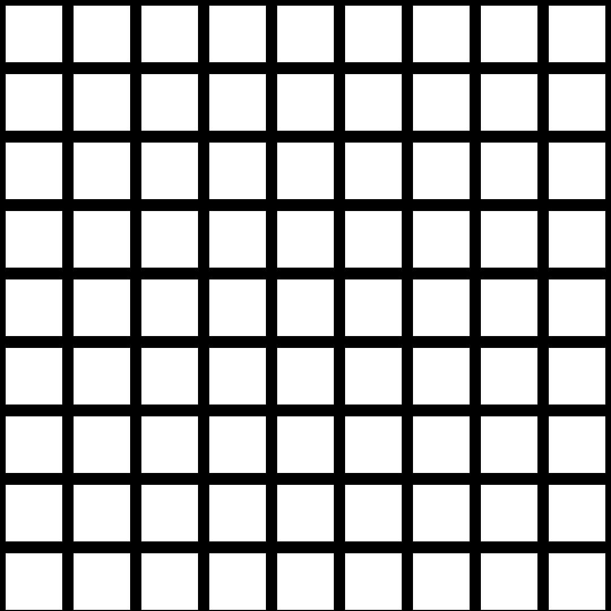
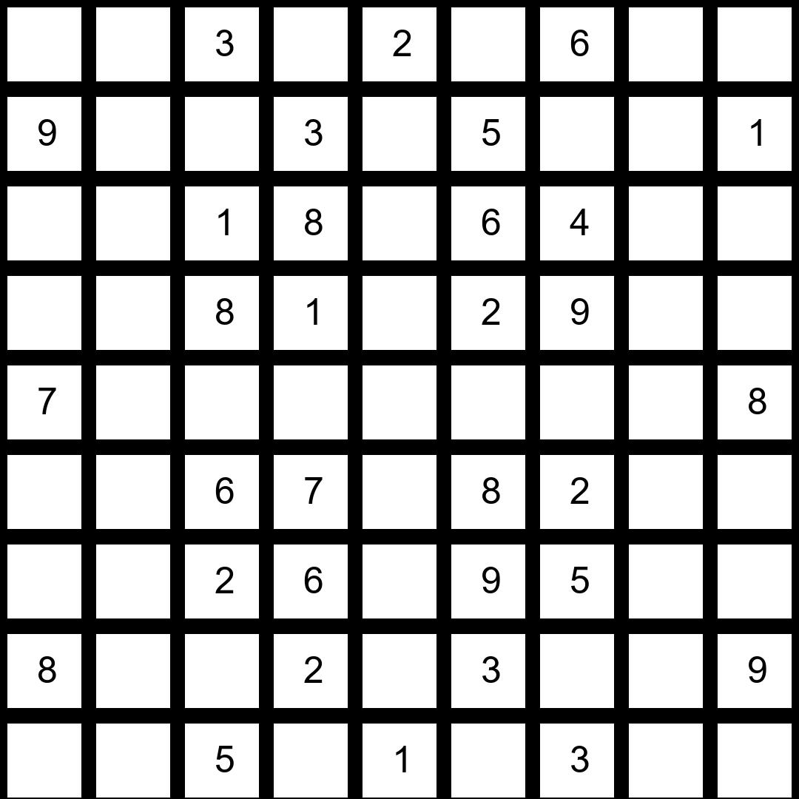
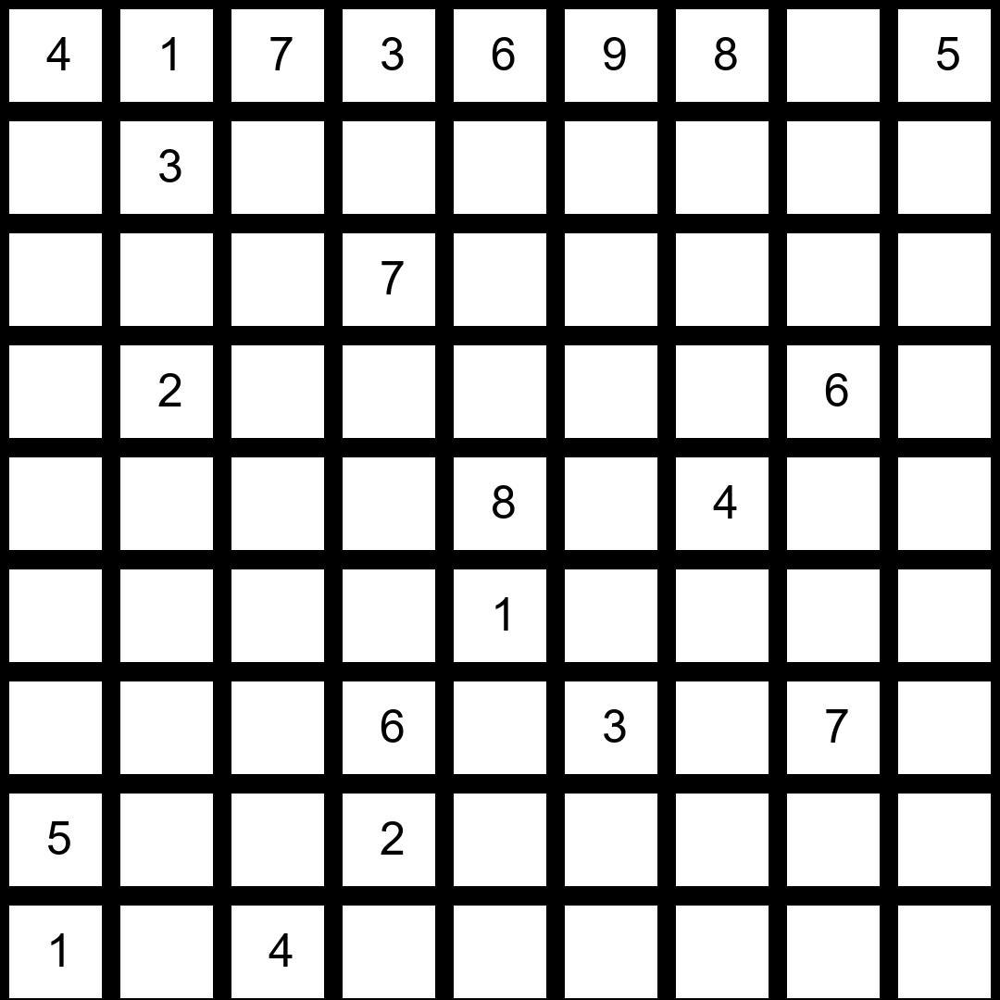
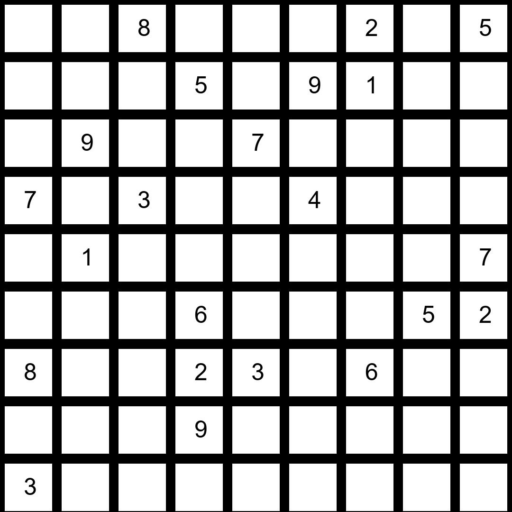
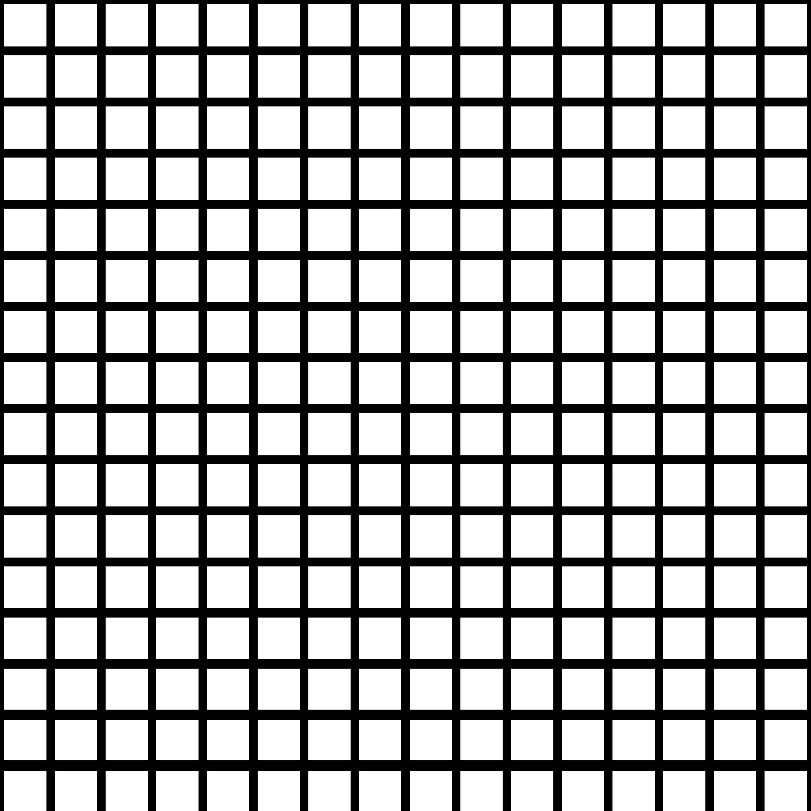
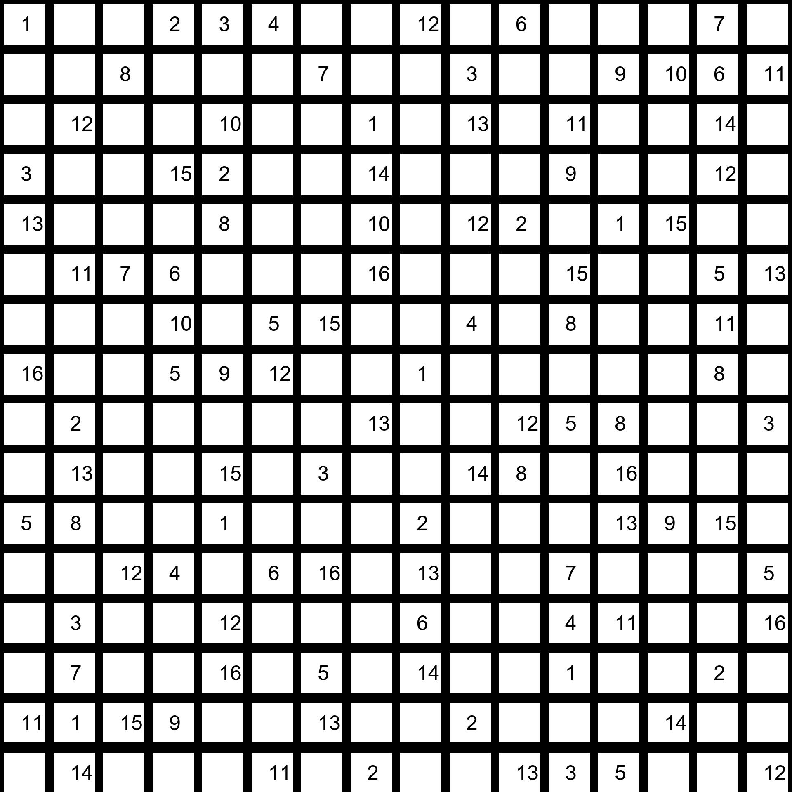
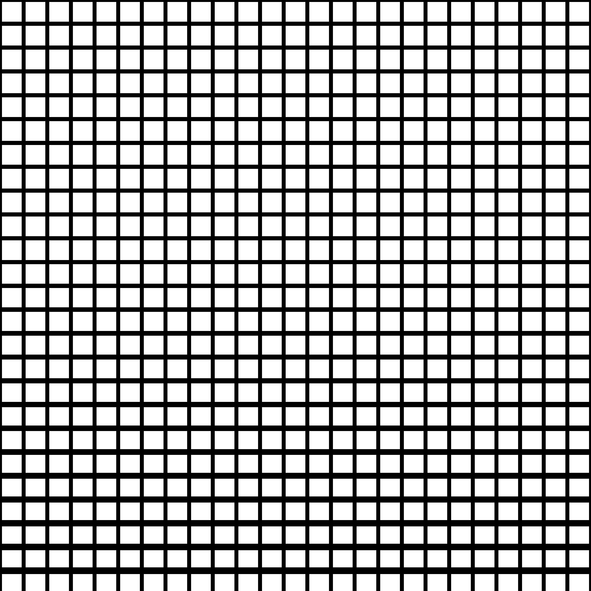
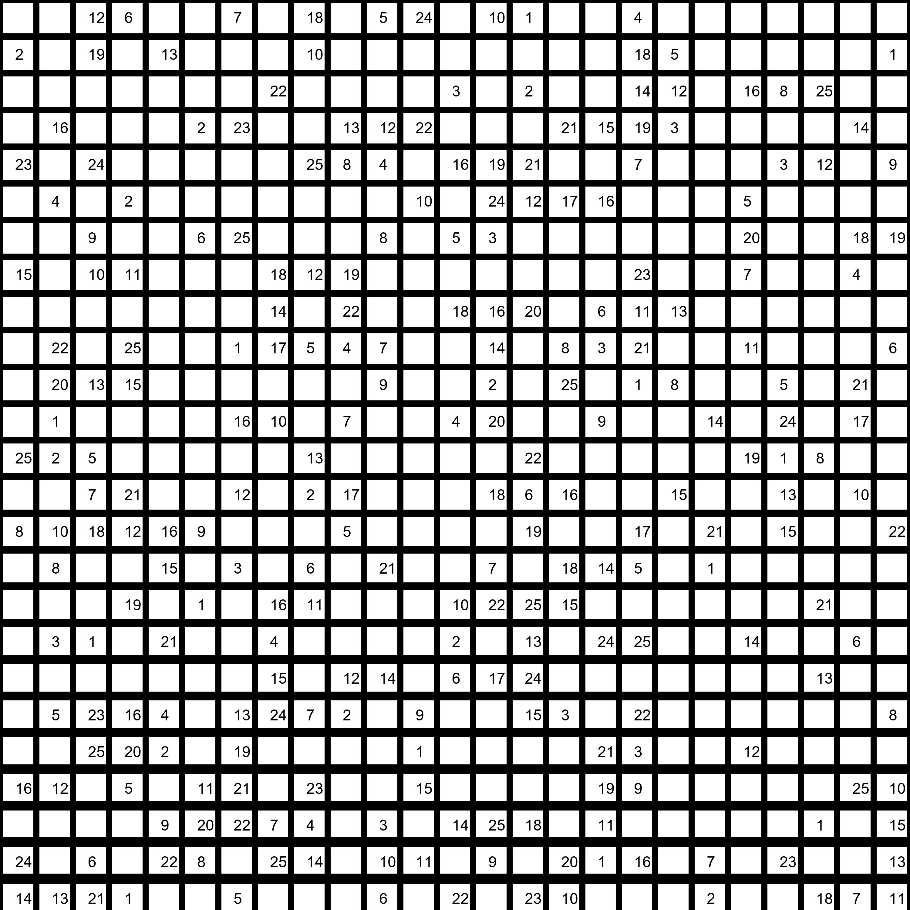
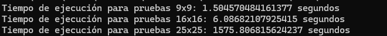

# Proyecto 3 - CI-5437

## Solución eficiente de Sudokus por medio del problema de satisfacción de restricciones o CSP

En este proyecto se verifica cuáles son los mejores algoritmos utilizados para CSP en la resolución del problema de Sudoku. Se realizaron pruebas con los siguientes tableros:

Tablero 9x9 Vacío

Tablero 9x9 Easy

Tablero 9x9 Hard1

Tablero 9x9 Hard2

Tablero 16x16 Vacío

Tablero 16x16 Hard16

Tablero 25x25 Vacío

Tablero 25x25 Hard25

### Corrida

Las pruebas para los tableros anteriores pueden realizarse al correr el archivo

	python main.py

Los archivos search, utils y CSP contienen código proveniente de la librería AIMA y han sido modificados para solucionar Sudokus de todos los tamaños y además se incluye la librería multiprocessing de Python para el manejo de los casos en los que la corrida tiene un tiempo muy grande. Si la corrida dura más de 120 segundos, se termina la función. Esta modificación se realizó debido a que algunos algoritmos y heurísticas en conjunto tenían una duración superior a las 8 horas, con la librería multiprocessing se puede correr el programa en un menor tiempo, con los algoritmos y heurísticas que dan un resultado en un tiempo aceptable.

Además se generan archivos CSV para cada corrida de cada tamaño. Y se indica la duración de cada una de las corridas.
